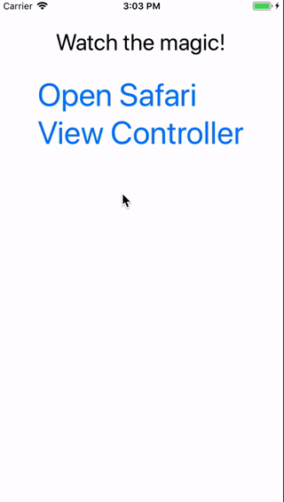
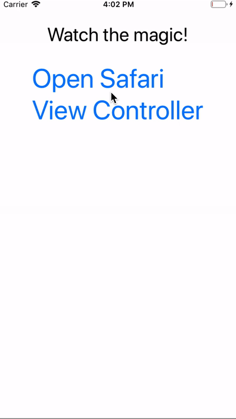

<a align="center" href="https://www.npmjs.com/package/nativescript-ssoauth">
    <h3 align="center">SSOAuth</h3>
</a>
<h4 align="center">
Using <a href="https://developer.chrome.com/multidevice/android/customtabs#whatarethey">Chrome Custom Tabs</a> on Android and <a href="https://developer.apple.com/reference/safariservices/sfsafariviewcontroller?language=objc">SFSafariViewController</a> on iOS to achieve SSO Auth redirection to the application.
</h4>

* This project is a fork of [Advanced WebView Project](https://www.npmjs.com/package/nativescript-advanced-webview)

----------

[Here is a video](https://youtu.be/LVseK_CZp5g) showing off Chrome CustomTabs in NativeScript.

#### Android

[CustomTabs](https://developer.android.com/reference/android/support/customtabs/package-summary.html)

#### iOS

[SFSafariViewController](https://developer.apple.com/reference/safariservices/sfsafariviewcontroller?language=objc)

### Why use this? Because Perf Matters

[Android Comparison](https://developer.chrome.com/multidevice/images/customtab/performance.gif)

### DemowhateverYouLike

| Android                                   | iOS                                             |
| ----------------------------------------- | ----------------------------------------------- |
|  |  |

## Installation

To install execute (Coming soon...)

```
tns plugin add nativescript-ssoauth
```

## Example

#### TypeScript

Initiate the service before the app starts e.g app.ts, main.ts

```typescript
import { init } from 'nativescript-ssoauth';
init();
```

```typescript
import { SSOAuthOpenUrl, SSOAuthOptions } from 'nativescript-ssoauth';

public whateverYouLike() {

    let opts: SSOAuthOptions = {
        url: 'https://www.youtube.com/watch?v=dQw4w9WgXcQ',
        toolbarColor: '#ff4081',
        toolbarControlsColor: '#333', // iOS only
        showTitle: false, // Android only
        onManualClose: closed => {
            console.log(`Manually closed: ${closed}`);
        },
        successCompletionHandler: url => {
            console.log(`Successful URL return: ${url}`);
        }
    };

    SSOAuthOpenUrl(opts);
}
```

#### Important! 
##### Listen for URL change by using CustomAppDelegate and call SSOAuthOpenUrlPostNotification

##### iOS

// custom-app-delegate-ios.ts
```typescript
import { SSOAuthOpenUrlPostNotification } from 'nativescript-ssoauth';

export class CustomAppDelegate extends UIResponder implements UIApplicationDelegate {
	public static ObjCProtocols: { prototype: UIApplicationDelegate }[] = [UIApplicationDelegate]; // tslint:disable-line:variable-name

	public applicationOpenURLOptions(
		app: UIApplication,
		url: NSURL,
		options: any
	): boolean {
		const lastArgument = arguments[arguments.length - 1];
		const previousResult = lastArgument !== options ? lastArgument : undefined;

		if (!previousResult) {
			SSOAuthOpenUrlPostNotification(url);
		}

		return true;
	}
}
```

// app.ts
```typescript
import { ios } from 'tns-core-modules/application';
import { isIOS } from 'tns-core-modules/platform';

if (isIOS) {
	const { CustomAppDelegate } = require('./custom-app-delegate-ios'); // tslint:disable-line
	ios.delegate = CustomAppDelegate;
}
```

##### Android
To listen for application redirection in Android - specify your schema name (example: `<data android:scheme="com.demoapp" />`)
together with other action and category.
```xml
<activity android:name="com.ActivityName">
<intent-filter>
    <action android:name="android.intent.action.VIEW" />
    <category android:name="android.intent.category.DEFAULT" />
    <category android:name="android.intent.category.BROWSABLE" />
    <data android:scheme="com.demoapp" />
</intent-filter>
</activity>
```

### API

- SSOAuthOpenUrl(options: SSOAuthOptions) // open URL
- SSOAuthExtractAppUrl(url: string) // extract returned URL and it's parameters
- SSOAuthOpenUrlPostNotification(url: string) // iOS only - post notification inside of ios.delegate

##### SSOAuthOptions Properties

- url: string
- toolbarColor: string
- toolbarControlsColor: string - ** iOS only **
- showTitle: boolean - ** Android only **
- isLogout: boolean
- onManualClose: Function
- successCompletionHandler: Function

##### Demo App

- fork the repo
- cd into `web` directory (recommend: use [http-server](https://www.npmjs.com/package/http-server) to serve files on port 8080)
- cd into the `src` directory
- execute `npm run demo.android` or `npm run demo.ios` (these cmds are in the package.json `scripts` section of the src if you're curious what is executing)
